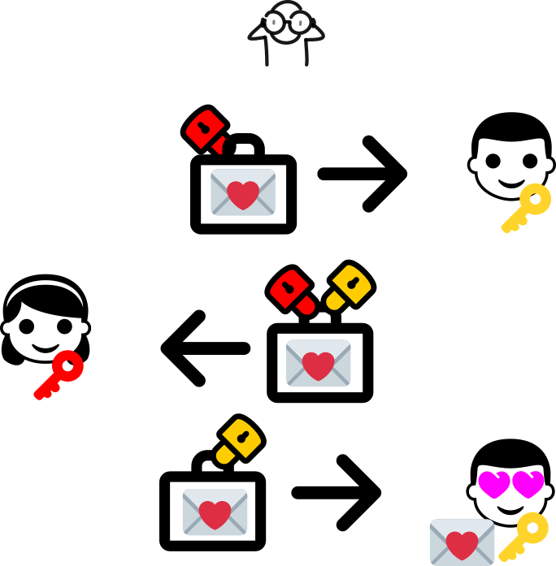
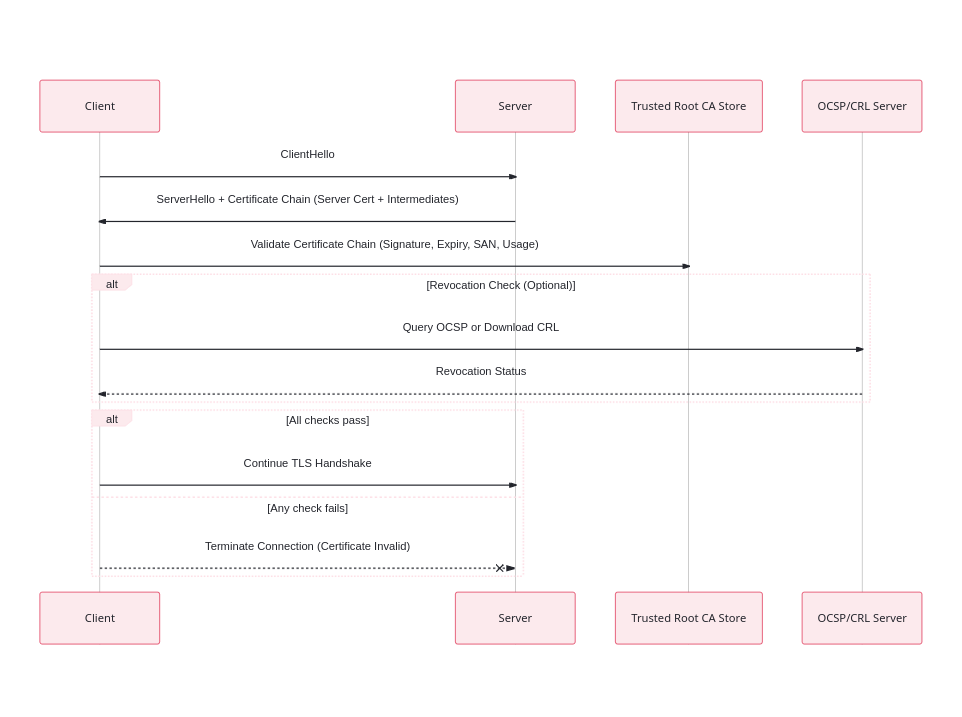

# TLS: Therapy for Trust Issues

<!-- Presenter Notes: Welcome the audience. This talk will explain what TLS and certificates are, and why you should care. -->

Digging in to HTTPS, TLS, and Certificates.

---

## What is TLS?
- Transport Layer Security
- Powers HTTPS
- Provides: Confidentiality, Integrity, Authentication

---

# ❓ Why should you care?

Without TLS:

❌ Anyone can read your traffic  
❌ Anyone can impersonate servers  
❌ You can't trust who you're talking to

TLS makes it safe to:

✅ Buy things online  
✅ Communicate securely over the internet  
✅ Deploy APIs securely

So lets just add an https and we're done, right?

---
<!-- _color: white -->

# One does not simply type https
---
# Lets start with certificates

<!-- Presenter Notes: Describe what a certificate is in simple terms - a digital passport signed by an authority. -->

Digital ID card 🪪 
    - Public Key, Issuer, Subject, Validity Dates
    - Separate Private key

Its a way to extend trust using a chain of maths

---

# 🚧 Inside a Certificate: X.509 & ASN.1

X.509 certs are structured data: **typed fields**, encoded with ASN.1.

**🧱 X.509 is a schema**:

- Subject & Issuer names
- Serial number
- Validity period
- Public key info
- Signature algorithm
- Extensions (SAN, Key Usage, etc.)

---

**📦 ASN.1 is the encoding language**  
- Stands for *Abstract Syntax Notation One*
- Specifies how to serialize structured data  
- Most certs use **DER** (binary) or PEM (Base64-wrapped DER)

```text
-----BEGIN CERTIFICATE-----
MIID...
-----END CERTIFICATE-----
```

<!-- _notes: presenter 

    X.509 is like a schema—it says what fields a cert should have.

    ASN.1 is a way of defining and encoding structured data. It's compact, binary, and type-annotated.

    DER is the strict binary encoding; PEM is DER in Base64.

    Tools like openssl and Wireshark decode the structure into readable text.

    It feels arcane, but it’s very deterministic and machine-friendly.
-->
---

### 📜 Is it a CA or a Leaf?
Spot the difference:
```text
X509v3 Basic Constraints:
    CA:TRUE

X509v3 Key Usage:
    Certificate Sign, CRL Sign
```
```text
X509v3 Basic Constraints:
    CA:FALSE

X509v3 Key Usage:
    Digital Signature, Key Encipherment
```
---

# 🔍 PEM vs DER vs Decoded

**🔐 PEM format (Base64-encoded DER)**  
Easier to copy/paste, but still just encoded binary:

```text
-----BEGIN CERTIFICATE-----
MIIDYDCCAkigAwIBAgIUFx...
... lots of Base64 ...
-----END CERTIFICATE-----
```
**🔐 PEM format (Base64-encoded DER)** 
Not as easy to look at
```
30 82 04 a3 30 82 03 8b a0 03 02 01 02 ...
```
---
# Public Key Encryption

**Public Key Cryptography:**  
Allows two parties to communicate securely without sharing a secret beforehand.

- Uses a **Key Pair**: Public Key + Private Key
- 🔑 Public Key: Can be shared with anyone
- 🔐 Private Key: Ideally stays on device its generated on

---

# Rivest-Shamir-Adleman (RSA)

**RSA Key Exchange:**

- Based on the difficulty of **Integer Factorisation**
- Common key sizes: 2048, 3072, 4096 bits
- Used in TLS for key exchange (rare today), signatures, encryption

**How it works:**

1. Server sends **Public Key**
2. Client generates **random key**, encrypts with Public Key
3. Server decrypts with **Private Key**

<!-- Presenter Notes: Explain how RSA is conceptually simple but computationally expensive. Mention why it's being replaced. -->
<!-- Presenter Notes: 
Mention that RSA relies on the difficulty of factoring large prime numbers.
However, if large-scale quantum computers become practical, RSA (and most public key systems based on factoring or discrete logarithm problems) will be vulnerable.
The quantum algorithm that can break RSA is called **Shor's Algorithm**.
Encourage the audience to look up "Shor's Algorithm" and "Post-Quantum Cryptography" if they want to know more.
-->

---

# Elliptic Curve Cryptography (ECC)

**ECC Key Exchange:**

- Based on the difficulty of the **Elliptic Curve Discrete Logarithm Problem**
- Much smaller keys: 256-bit ECC ≈ 3072-bit RSA
- Common curves: `secp256r1`, `x25519`

**Why ECC?**

- Faster computations
- Smaller keys and signatures
- More efficient for mobile, IoT, and modern systems

<!-- Presenter Notes: Mention that ECC is preferred today because it's more efficient and secure at smaller key sizes. -->

---

# Quantum Computing is coming

**Shor's Algorithm**
https://www.classiq.io/insights/shors-algorithm-explained

_sounds like a "future me" problem, lol_ 

<!-- As far as we know, in 2025 there arent any computers that can do this yet, but there is a lot of work going on to make it happen. 
Lattice based problems are the new Hard Problem here - Learning With Errors and Shortest Vector Problem in huge lattices. -->
---

# Post-Quantum Cryptography

**Work in progress:**  
Cryptographers are developing new algorithms that are resistant to quantum attacks.

Some examples:
- 🪄 **Kyber** (key exchange)
- ✉️ **Dilithium** (digital signatures)

https://www.nist.gov/pqcrypto

---
# TLS Handshake

<!-- Presenter Notes: Explain how the handshake is like setting up a secret conversation over an insecure channel. Emphasize key exchange and certificate delivery. 
Client proposes versions, cipher suites
Server chooses and responds with certificate
Key exchange with DH or RSA
Session key derived -->

Ways to get strangers talking privately

1️⃣ **ClientHello** → here's what I understand
2️⃣ **ServerHello** → sure, let's use this
3️⃣ **Key Exchange** → Diffie-Hellman or RSA
4️⃣ **Session Keys** → symmetric encryption
5️⃣ **Encrypted Communication starts**

---

# 🔐 TLS Handshake: ClientHello

The client starts the handshake by sending:

📄 **TLS Version(s)** it supports (e.g. TLS 1.2, 1.3)  
🔑 **Cipher Suites** it supports (key exchange, encryption, MAC)  
🧩 **Extensions** (ALPN, SNI, etc.)  
🎲 **Random Number** (used to derive session keys)  
📬 **Key Share** (optional, only in TLS 1.3 — client's Diffie-Hellman public key)

<!-- Presenter Notes: Explain that the client is advertising everything it supports. The server will choose from this list. The client also needs to share who it wants to talk to! 

    Server Name Indication (SNI):
        Allows the client to specify the hostname of the server it is trying to connect to. This is crucial for servers hosting multiple domains on the same IP address.

    Supported Groups (Elliptic Curves):
        Lists the elliptic curve groups that the client supports for key exchange, used in elliptic curve cryptography.

    Elliptic Curves Point Formats:
        Specifies the point formats that the client supports for elliptic curve cryptography.

    Signature Algorithms:
        Indicates the signature algorithms that the client supports for verifying the server's certificate.

    Application-Layer Protocol Negotiation (ALPN):
        Allows the client to specify the application-layer protocols it supports, such as HTTP/2 or HTTP/1.1.

    SessionTicket TLS:
        Used for session resumption, allowing the client to resume a previous session without performing a full handshake.

    Key Share:
        Contains the client's key share for the key exchange algorithm being used, such as Diffie-Hellman or elliptic curve Diffie-Hellman.

    Supported Versions:
        Lists the TLS versions that the client supports, allowing the server to select the highest mutually supported version.

    Pre-Shared Key (PSK) Key Exchange Modes:
        Indicates the PSK key exchange modes that the client supports, used for session resumption with pre-shared keys.

    Padding:
        Adds padding to the ClientHello message to mitigate certain types of attacks, such as traffic analysis.

    Encrypt-then-MAC:
        Indicates support for the "encrypt-then-MAC" extension, which changes the order of encryption and MAC computation to improve security.

    Extended Master Secret:
        Provides additional protection against certain types of attacks by extending the master secret used in the TLS handshake.

    Renegotiation Info:
        Used to securely renegotiate the TLS connection parameters without being vulnerable to certain attacks.

    Heartbeat:
        Used in the Heartbeat Extension to keep the connection alive and test the secure connection.
-->

---

# 🔐 TLS Handshake: ServerHello

The server responds with:

📄 **TLS Version** (chosen from client's list)  
🔑 **Selected Cipher Suite**  
🎟️ **Session ID or Ticket** (optional, for session resumption)  
📜 **Server Certificate** - but which one?
📬 **Key Share** (only in TLS 1.3 — server's Diffie-Hellman public key)  
🧩 **Extensions** (e.g., ALPN protocol)

<!-- Presenter Notes:
Explain that the server is choosing from the client’s offered options.
It sends its certificate here so the client can authenticate it.
In TLS 1.3, the server also sends its Diffie-Hellman key share here to reduce round trips.
Here, extensions are confirmations of the clients requested ones.
-->

---

# 🚀 Aside.. TLS 1.3: What's Different?

TLS 1.3 streamlined the handshake:

⚙️ **Fewer round trips**  
- Server sends its Diffie-Hellman key in **ServerHello**  
- No separate `ServerKeyExchange` message

🔒 **Only strong cipher suites allowed**  
- Removed insecure options

🔑 **Forward secrecy by default**  
- Always uses ephemeral keys (ECDHE)

🪄 **Session resumption is more efficient**

<!-- Presenter Notes:
TLS 1.3 simplified and hardened the handshake.
No more optional weak algorithms.
Key exchange is now merged into ServerHello to speed up connection.
-->

---

# 🔐 TLS Handshake: Key Exchange

After `ServerHello`:

🔑 **Client and server exchange ephemeral public keys**  
(ECDHE key shares, if not already exchanged in ServerHello)

🤝 **Both parties derive the shared secret**  
- Based on Diffie-Hellman key agreement

🔗 **Session keys are derived**  
- Typically using a **Key Derivation Function (KDF)** like HKDF

<!-- Presenter Notes:
At this point, both sides have everything needed to compute a shared secret.
This secret is used to encrypt all future communication. Symmetric encryption is much faster and lightweight. So we agree on this key using assymetric encryption, then switch for speed. We can resume this later 
-->

---

# ✅ TLS Handshake: Finished

Finally:

📜 **Client verifies server certificate**  
(our full chain validation sequence)

🧩 **Optional: Client authentication**  
- Rare on the web, but possible

🔒 **Finished messages exchanged**  
- Both parties prove they derived the same session keys (the verify_data field)

🔐 **Secure session established**

<!-- Presenter Notes:
The handshake ends here.
Both client and server now share session keys and start encrypted communication.
-->

---

# 🔐 TLS Handshake: The Session Key

**What is the Session Key?**

The session key is:

🔑 A **symmetric encryption key**  
🔄 **Derived during the handshake**  
📅 **Ephemeral: Valid only for this session**  
🚀 **Used to encrypt & authenticate all application data**

**Why use a Session Key?**

✅ Symmetric encryption is **fast**  
✅ Secure against eavesdropping  
✅ No need to use expensive asymmetric crypto after handshake

<!-- Presenter Notes:
Explain that the handshake is all about securely agreeing on a session key.
Forward secrecy! If the session is recorded, even with the server key an attacker can't decrypt without the "Pre-Master secret (which is used to generate the master secret and session keys)
Once the handshake finishes, all HTTPS traffic is encrypted using this symmetric session key.
This is why TLS is both secure and efficient.
-->
---


# 💌 The Discrete Logarithm Problem: A Love Story

**Diffie-Hellman (DH) & Elliptic Curve Diffie-Hellman (ECDH)**

Both allow two people to agree on a shared secret **without anyone else knowing**, even if everyone can see the messages being passed. Thanks Discreet Logarithm Problem!

<!-- Presenter Notes:
Introduce this slide as "a love story" — two parties exchanging secrets in class without the teacher (attacker) knowing.
Explain that the security of both DH and ECDH relies on the discrete logarithm problem being hard to reverse.
This is what allows the shared secret to be created without ever being sent.
🤯 Easy to compute in one direction  
🕵️‍♂️ Almost impossible to reverse without the private key  
🚀 ECDH is faster and uses smaller keys than DH
- Based on the **Discrete Logarithm Problem (DLP)**
    - Given `g` and `g^a mod p`, it’s hard to find `a`
- In **Elliptic Curve DH (ECDH)**:
    - Same idea, but over **elliptic curves**
    - Hard problem: **Elliptic Curve Discrete Logarithm Problem (ECDLP)**
-->
---

# 🔄 Quick Recap

✅ **TLS Overview**  
- What TLS is and why it matters

✅ **Public Key Cryptography**  
- RSA, ECC and the role of certificates

✅ **TLS Handshake**  
- How client and server agree on how to communicate securely

✅ **The Discrete Logarithm Problem**  

Easy peasy from here, right?

<!-- Presenter Notes:
Pause here to recap. Give the audience a moment to reflect on what we've covered.
Remind them that next we're going to talk about how the server knows who you're trying to connect to, and how that information can leak.
-->

---

<!-- _color: white -->
# One does not simply guess which certificate to serve
---

# Serving multiple sites - what cert?
## Server Name Indication (SNI)

**What is SNI?**

- Part of the **TLS ClientHello**
- Tells the server **which hostname** the client wants to connect to
- Enables **virtual hosting** (multiple domains on one IP)

**Problem:**
- SNI is sent in **clear text**
- Anyone on the network can see **which website** you're connecting to

<!-- Presenter Notes: Explain that SNI solved a technical need for shared hosting, but introduced a privacy leak because it’s visible during handshake. -->

---

## Encrypted Client Hello (ECH)

**What is ECH?**

- Aims to fix the SNI privacy leak
- Encrypts sensitive parts of **ClientHello**, including SNI
- Requires an ECH public key (usually fetched from DNS)

**Status:**
- Still experimental
- Supported by some browsers & servers
- Not supported by common CLI tools like curl or openssl

https://blog.cloudflare.com/encrypted-client-hello/

<!-- Presenter Notes: Emphasize that ECH is part of the handshake, and prevents anyone from seeing the hostname. It’s not widely deployed yet. -->

---

# Certificate Validation

<!-- Presenter Notes: Walk the audience through how a client validates a server certificate, step by step. Mention where trust can fail. -->

The client performs these steps:

- Chain Validation
- Signature Verification
- Expiry Check
- Subject/SAN Check
- Usage Check
- (Optional) Revocation Check

---



---

# 🚨 When TLS Goes Wrong

<!-- Presenter Notes: Give real-world examples of what goes wrong if validation fails - MITM attacks, revoked certificates, weak algorithms. -->

- Certificate Misissuance
- Certificate Revocation Failures
- Weak Algorithms (e.g. MD5, RSA-1024)
- Man-in-the-Middle (MITM)
- Expired/Revoked Certs


---
# Live Demo & Exercises

<!-- Presenter Notes: Attached jupyter notebook - Encourage the audience to follow along. Show how tools like curl and openssl help debug TLS issues. -->

---

# 🛠️ A few tools and links

- Client testing
    - https://www.howsmyssl.com/
    - https://tls.support/
- Server testing
    - https://www.ssllabs.com/ssltest/
    - https://testssl.sh/ (local tool)
    - [curl](https://curl.se/docs/manpage.html)
    - [openssl s_client](https://docs.openssl.org/3.0/man1/openssl-s_client/)
- [Cert internal data structure](https://letsencrypt.org/docs/a-warm-welcome-to-asn1-and-der/)
- [ASN.1 for Dummies](https://coolaj86.com/articles/asn1-for-dummies/)

---
# Summary

<!-- Presenter Notes: Recap key takeaways. TLS isn't magic, it's careful math + trust. Make the audience feel confident they understand certificate validation now. -->

✅ TLS is not magic — it's careful math & trust  
✅ Certificate validation is critical  
✅ Revocation, expiry, chain issues = instant failure  
✅ Tools: `openssl`, `curl`, `httpx` help you debug  
✅ **What could possibly go wrong?**

These resources are MIT licensed - PRs welcome
https://github.com/HG00/talk-tls-therapy

Thank you! 🎤

